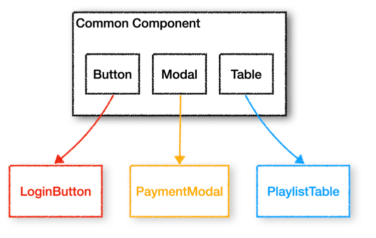
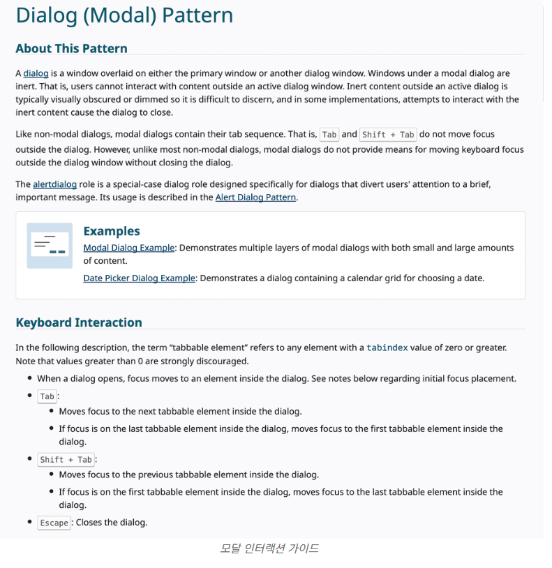

## 들어가면서

공통 컴포넌트를 만들때 어떤 점을 고려하나?

- 두 군데 이상에서 반복되면 공통 컴포너틀로 만든다.
- 도멩니에 종속적인 커뫂너트는 공통화하지 않는다.

이버글에서는 공통 컴포넌트의 정의나 철학같이 개인 차이가 있을 수 있느 ㄴ부분들은 다루지 않고
공통 컴포넌트를 좀 더 쓸모 있고 가지잇게 만드느데 필요한 고민들에 집중할것

## 1. 확장 규칙 설계

개부부으니 코드에서 아주 작은 차이 때문에 그대로 사용하기 어려운 경우가 많다.
대표적으로 패딩, 텍스틑 크기가
ontouchStart같이 잘 사용하지 않는 메서드가 필요한 경우도 있음
무분별한 prop은 ㅎ가치를 떨어뜨ㄹ릴것

따라서 적절한 ㅋ공통 컴포넌트 확장 규칙 컨벤션 설정이 필요

### 1-1 명확한 컴포넌트 역할(만능 지양하기)

개발하고자 하는 공통 컴포넌트의 역할 경계를 명확학세 하는것

가령 Button을 만든다고 해보자.

```tsx
export default function Button() {
    return <button className="default-button-class">
}
```

위의 컴포넌트를 보고 이런 생각이 들 수 있다.

> 디자인이 없는 Button컴포넌트를 만들고 props으로 className을 부여하는게 좀 더 확장성 있는 설계 아닌가?

맞는 말이다.

하지만 확장성 있느 ㄴ설계에 앞서 공통 컴포넌트의 궁극적인 목적을 생각해보아야함
우리는 공통을 사용함으로 개바시간으 줄이고 유지보수를 간편하게 할 수 있어얗마
많은 역할을 수행하도록 변경할 수록 사용하는 쪽에서는 prop을 더 구체적으로 명시해야함
유지보수에 많은 시간을 소몽하게 되는데, 본래의 목적을 퇴색하게 함

그러므로 프로젝트의 규모와 상황에 맞게 개밣하고자하는 공통 컴포넌트의 책임과 역하을 명확히 하고 경계ㅒ를 버성나지 않는 선에서 확장성을 확보애햐함

위으이경우 프로젝트냉세ㅓ 반복적으로 사용죄는 버튼 커포먼ㅌ 기본적인 형태라는 책임을 부여했다면 다른 것을 고려할 필요ㅕㄱ없음
추가로 개발하는게 더 나음

```tsx
// common/BaseButton.tsx
import cn from 'classnames';

interface Props {
	className?: string;
}

export default function BaseButton({ className }: Props) {
	return <button className={cn('base-button-class', className)} />;
}

// common/MelonButton.tsx
export default function MelonButton() {
	return <BaseButton className='melon-button-class' />;
}

// common/KakaoButton.tsx
export default function KakaoButton() {
	return <BaseButton className='kakao-button-class' />;
}
```

이것이 컴포넌트의 확장성을 고려하기 시작할 때 각 공통 컴포넌트를 활용한 개발의 생산성을 떠어드리지 ㅇ낳도로 ㄱ하기위한 장치임
이러한 컴포넌트 역하을 정하는데 단일 책임원칙과 같은 여럭가지 방법론을 적요할 수 있다.

### 1-2 인터페이스 정책

인터페이스를 활용해 공통 컴포넌트의 확장성을 확보함
스타일을 조금씩 다른경우 기존 공통의 재활용하기도 새로운 컴포넌ㄴ트를 만들기도 애매한 경우있음
오늘날에는 Tailwindcss가 굉장히 좋음
className props에 classnames라이브러리의 기능과 tailwincss클래스를 입력해 충분히 많은 디자인에 대응 가능

그러나 모든 className을 설정하는것을 굉장히 버넉롭고 휴먼 에러발생가능함
이때 보통 variant를 활용해 대응 가능

```tsx
import cn from 'classnames';

interface Props {
	className?: string;
	variant?: 'primary' | 'secondary' | 'none';
}

export default function MelonButton({ className, variant }: Props) {
	return (
		<button
			className={cn(
				'melon-button-class',
				{
					'primary-class': variant === 'primary',
					'secondary-class': variant === 'secondary',
				},
				className
			)}
		/>
	);
}
```

위의 경우 공통 컴포넌트 사용자가 요ㅕ구사항에 다라 적절한 variant를 부여하여 다양한 디자인에 대응 가능
곹ㅇ통 컴포넌트 개발자는 새로운 유형의 버튼 추가나 수정에 대응하기 위워짐

그런데 모든 상황을 variant로 대응하는것을 한계가 있음
따라서 인터페이스의 상속과 rest parameters를 사용해 해결가능

리액트 타입의 경우 모든 DOMElement의 attribute를 props으로 가진 인터페이스를 제공하기에 확장성있느 설계 가능

> 주의할 점은 rpros에 rest parameter를 추가할 댸ㅖ, 자신이 정한 명확한 컴포넌트 역하을 해치는 방향인지 곰니해야함. rest parameter를 추가해싸고 해서 기존의 props을 느슨하는하는것은 올바르지 않음

```tsx
import cn from 'classnames';
import { ButtonHTMLAttributes } from 'react';

interface Props extends ButtonHTMLAttributes<HTMLButtonElement> {
	variant?: 'primary' | 'secondary' | 'none';
}

export default function MelonButton({ className, variant, ...rest }: Props) {
	return (
		<button
			className={cn(
				'melon-button-class',
				{
					'primary-class': variant === 'primary',
					'secondary-class': variant === 'secondary',
				},
				className
			)}
			{...rest}
		/>
	);
}
```

- 이제 모든 상황에 대응할 수 잇고 본래의 책임을 잃어버리지 않음
- 그러면 무조건 이렇게하면 좋을까? ㄴㄴ 단점이 있음

1. 사용자는 각 prop의 역하을 파악하기 어렵
   1. 내가 사용하는 props이 오버라이딩된 props인지 파악하기 어렵기에 예상하지 ㅇ낳은 형태로 동작 가능
   2. 또한 IDE에 의해 불필요 prop들이 같이 나열되서 개발자 ㅇ의조치 않은 props사용가능
2. 유지보수 관ㄴ점에 어려움 있음
   1. 리팩토링진해하면 겉보기 동자(observable behavior)은 변하지 않아야하는데
   2. 리팩토링 후 모든 prop이 같은 기능을 수행할것이라 장담하기 어려움
   3. 많일 공통 컴포넌트를 사용하는 곳에서 잘 쓰이지 ㅇ낳은 props이라사용한다면 모든 케이스에 대응ㅎ앟고 검즌하는 과정이 어려울것

여러 트레이드 오프를 고려해 적절한 상속 바운더리를 정하는게 좋음

## 2. 네이티브 요소의 활용

보편적으로 만들게 되는 공통 컴포넌트들의 대부분은 이미 존재하는 네네이티브 요소들을 사용할 겨웅 훨씬 효율저ㅗㄱ으로 높은 완성도 가능

## 2-1 네이티브 숨기기

```tsx
import { useState } from 'react';

export default function Checkbox() {
	const [checked, setChecked] = useState(false);

	return <div onClick={() => setChecked(!checked)}>{checked ? <CheckedIcon /> : <UncheckedIcon />}</div>;
}
```

몇가지 문제 있음

- DOM을 직접 탐색해서 체크박스를 Disabled로 변경하렴녀 어케함?
- 혹은 탭을 통해 체크박스에 포커스하길 원한다면?

사소하지만 완성도를 높이는 모든 기능으 룩현하늑데는 한계가 있음
따라서 이렇게 네이티브 요소를 활용하고 이를 tricky하게 숨기기를 권장함

```tsx
import { useState } from 'react';

export default function Checkbox() {
	const [checked, setChecked] = useState(false);

	return (
		<div
			style={{
				width: 'fit-content',
				position: 'relative',
			}}>
			{checked ? <CheckedIcon /> : <UncheckedIcon />}
			<input
				type='checkbox'
				style={{
					position: 'absolute',
					left: 0,
					top: 0,
					width: '100%',
					height: '100%',
					opacity: 0,
				}}
				checked={checked}
				onChange={(ev) => setChecked(ev.target.checked)}
			/>
		</div>
	);
}
```

- 위 코드는 사용자가 체크 박스 아이콘을 클릭하면 사실은 아이콘이 아닌 네이티브 체크박스를 클릭하도록 구현된 예쩨임
- 이른 UI를 보고 액션을 발생시키는 사람이나 잔지 DOM구조를 보고 생견을 발생하는 브라우저 입장에서 같은 결과값을 가짐
- opacity외에도 label, hidden, 을 통해 숨기기 가능

### 2-2 controlled vs uncontrolled

둘 중 하나의 방식을 결정해야함
controlloed 방식의form 요소는 값을 상태값으로 관리하기 대문에 상태값을 추적하여 값이 변경되었느지 확인 간으
이는 상태갑ㅈㅅ을 기준으로 렌덜이되는 리액트 흐름에 적합한 방식

따라서 form 요소가 아닌 다른 컴포너트에서 지속해서 값을 바라보고 리렌덜이 필요하다면 controlloed방식이 적합함

```tsx
// controlled checkbox
interface Props {
	checked: boolean;
	onChange?: (checked: boolean) => void;
}

export default function Checkbox({ checked, onChange }: Props) {
	return (
		<input
			type='checkbox'
			checked={checked}
			onChange={(ev) => onChange?.(ev.target.checked)}
		/>
	);
}
```

하지만 이 방식을 값이 변경될 때마다 해당 ㄱ밧을 사용하자고 하는 부모 컴포넌트까지 state lifting해줘야하며
해당 부모 요소하위의 모든 요소를 리렌덜이하게 되는 사이드 이펙트 가져옴
또한 ㅁCheckboxGroup과 같은 상위 공통 컴포너틀르 만든다고할 때 불필요한 prop dilling가능

따라서 상황에 따라 uncontrolled방싣으로 제어하면, 과도하 리렌더링 방지 가능,
공통 컴포너틀ㄹ 사용한 개발의 DX향상 가능

다만 리액트에서는 사용자의 인터랙션에 딸느 이벤트 시스텡미 자체적으로 구축되지 않기에 Programmatic 한 방법으로 DOM을 직접 접근하여 값을 세팅하는경우 의도한 액션이 발생하지 않아 원하는 기능을 구현하는데 제약이 있음

```tsx
// uncontrolled checkbox
interface Props {
	onChange?: (checked: boolean) => void;
}

export default function Checkbox({ onChange }: Props) {
	return (
		<input
			type='checkbox'
			onChange={(ev) => onChange?.(ev.target.checked)}
		/>
	);
}
```

필자의 경우 내부적으로 는 controlled로 돌아가되 공통 컴포넌트를 가지고 개발하느 사용자 입장에서는 마치 uncontrolled처럼 사용할 수 있도록 인터페이슬 구성하는 방실을 선호함

```tsx
// mixed checkbox
import { ChangeEvent, useState } from 'react';

interface Props {
	checked?: boolean;
	onChange?: (checked: boolean) => void;
}

export default function Checkbox({ checked: controlledChecked, onChange }: Props) {
	const isControlled = controlledChecked !== undefined;
	const [checked, setChecked] = useState(false);

	const handleChange = (ev: ChangeEvent<HTMLInputElement>) => {
		const checked = ev.target.checked;

		if (!isControlled) {
			setChecked(checked);
		}

		onChange?.(checked);
	};

	return (
		<input
			type='checkbox'
			onChange={handleChange}
			checked={isControlled ? controlledChecked : checked}
		/>
	);
}
```

### 2-3 forwardRef

form요ㅕ소를 공통으로 만들다보면ref해야함
ref는 prop으로 전달 못하므로 forwardRef해야함
만얀 안깜싸면 내부적으로 ref를 사용해야하는 react-hook-form같은 라이브러리 사용에 제약이 있음

```tsx

import { InputHTMLAttributes, forwardRef } from 'react'

interface Props extends InputHRMLAttributes<HTMLInputElement>{}

export default forwardRef<>(function Checkbox({...rest}, ref){
    return <input type="checkbox" ref={ref} {...rest}>
})
```

따라서 모든 인풋 요소는 forwardRef로 깜사는것을 권장함

## 3. 웹 접근성

중요한점은 사람이 아니라 프로그램이 읽을 수 있도록 설계하는것
웹 접근성이 훌륭하다면 UX의 향상 및 테스트코드를 구성할 때 강점이 있음

### 3-1 Semantic Tag

문장의 단락은 div대신 p가 좋다.

```tsx
import { PropsWithChildren } from 'react';

export default function TextBlock({ children }: PropsWithChildren) {
	return <p>{children}</p>;
}
```

### 3-2 ARIA Field

ARIA Field(Accessible Rich Internet Applications)는
웹 콘텐츠에 쉽게 접근하기 위해 DOMElement에 부여하는 attribute임
체크박스, 탭 테이블에 보편적인 구성요소에 role과 aria-field를 부여함으로 컴포너트에서 어떤 기능을 담당하는요소인지 명확하게 알려줄 수 있음

탭 컴포너틑를 통해 간단한 예시 만듬
탭은 크게 탭, 탭리스트, 탭 패널로 구성되고
비교적 aria-field가 많음

```tsx
import { ButtonHTMLAttributes } from 'react';

interface Props extends ButtonHTMLAttributes<HTMLButtonElement> {
	tabName: string;
	isSelected: boolean;
}

export default function Tab({ tabName, isSelected, ...rest }: Props) {
	return (
		<button
			id={`tab-${tabName}`}
			type='button'
			role='tab'
			aria-selected={isSelected}
			aria-controls={`tabpanel-${tabName}`}
			{...rest}
		/>
	);
}
```

- 탭을 전환하기 위하 ㄴ버튼으로 role을 tab으로 명시함
- 현재 탭이 성택되었다면, aria-selected를 true로 전환함
- 또한 현재 탭에 의해 보이는 패널의 라벨을 aria-controls로 제공함
- id의 경우 중보하지 않도록 주의해야함

```tsx
import { HTMLAttributes } from 'react';

interface Props extends HTMLAttributes<HTMLDivElement> {
	tabName: string;
	isSelected: boolean;
}

export default function TabPanel({ tabName, isSelected, ...rest }: Props) {
	return (
		<div
			id={`tabpanel-${tabName}`}
			role='tabpanel'
			hidden={!isSelected}
			aria-labelledby={`tab-${tabName}`}
			aria-hidden={!isSelected}
			{...rest}
		/>
	);
}
```

- 탭 패널의 경우 role을 tabpanel로 했고
- arai-labelledby를 통해 탭의 라벨을 붙여주며
- aria-hidden을 설정해 해당 탭이 보이는지 아니지 기록함
- 실제로 DOM에서 사라지는 핵션을 위해 hidden을 함께 사용함

```tsx
import { HTMLAttributes } from 'react';

interface Props extends HTMLAttributes<HTMLDivElement> {
	isSelected: boolean;
}

export default function TabList({ ...rest }: Props) {
	return (
		<div
			role='tablist'
			{...rest}
		/>
	);
}
```

- 마지막 탭 리스트는 role을 tablist로 부여, 여러개의 탭을 하나의 리스트로 관리
  이러면 스크린 스캐너의 도움으로 현재 어떤 탭이 열려있는지 확인 가능
  테스트 코드도 작성가능

```tsx
it('선택된 탭 패널 외에는 노출되지 않는다.', () => {
	render(
		<TabGroup selectedTabName='tab1'>
			<TabGroup.List>
				<TabGroup.Tab tabName='tab1'>Tab1</TabGroup.Tab>
				<TabGroup.Tab tabName='tab2'>Tab2</TabGroup.Tab>
				<TabGroup.Tab tabName='tab3'>Tab3</TabGroup.Tab>
			</TabGroup.List>
			<TabGroup.Panel tabName='tab1'>panel1 contents</TabGroup.Panel>
			<TabGroup.Panel tabName='tab2'>panel2 contents</TabGroup.Panel>
			<TabGroup.Panel tabName='tab3'>panel3 contents</TabGroup.Panel>
		</TabGroup>
	);

	const panel1 = screen.getByLabelText('Tab1');
	const panel2 = screen.getByLabelText('Tab2');
	const panel3 = screen.getByLabelText('Tab3');

	expect(panel1).toBeVisible();
	expect(panel2).not.toBeVisible();
	expect(panel3).not.toBeVisible();
});
```

### 3-3 편의성 인터래션 추가하기

잘 짜인 공통의 경우, 사용자의 편의성을 제공하기 위해 구현된 기능이 많음
esc를 눌러 모달을 닫는지등, 방향키를 통해 드롭 다운의 포커스를 이동한다든
알게보르게 편의성 기능 제공함
직접 구현하는게 더 나은 UX를 제공할 수 있음
따라서 컴포넌트별로 주로 어떤 편의성을 제공하는지 조사하고 구현하느것이 더 컴포넌트를 가치있게 만듬


## 맺음말

- 공통 컴포넌트를 단지 재사용하기 위한 컴포너트 정도로만 생각하는 부들이 많음
- 하지만 더 큰 의미가 있음
- 개발자는 확장 규칙을 설계하여 재사용될 범위를 명확히 해야하고
- 네이티브 요소를 적극적으로 사용하여 완성도있는 컴포넌트를 만들어야함
- 또한 웹 접근성을 고려하여 다양한 사용자와 엔진에 대응해야함
- 이밖에도 오늘날에는 SSR이 유행하기 시작하면서 서버 컴포넌트도 고려해야하기도하며
- 모노레포와 github packages등 공통 컴포넌트를 더 적즈겆ㄱ으로활용할 수 있느 환경도 구축되고있음
- 따라서 우리는 시간을 투자해야만 함
- mui, react-bootstrap같이 유면항 라이브러리 코드를 열어보고 분석해보는 습관을 기르면, 개발자가 어떤 의도로 코드를 구성했는지 파악하는 과정에서 웹가 사용자를 더 잘 이해할게 될 것
