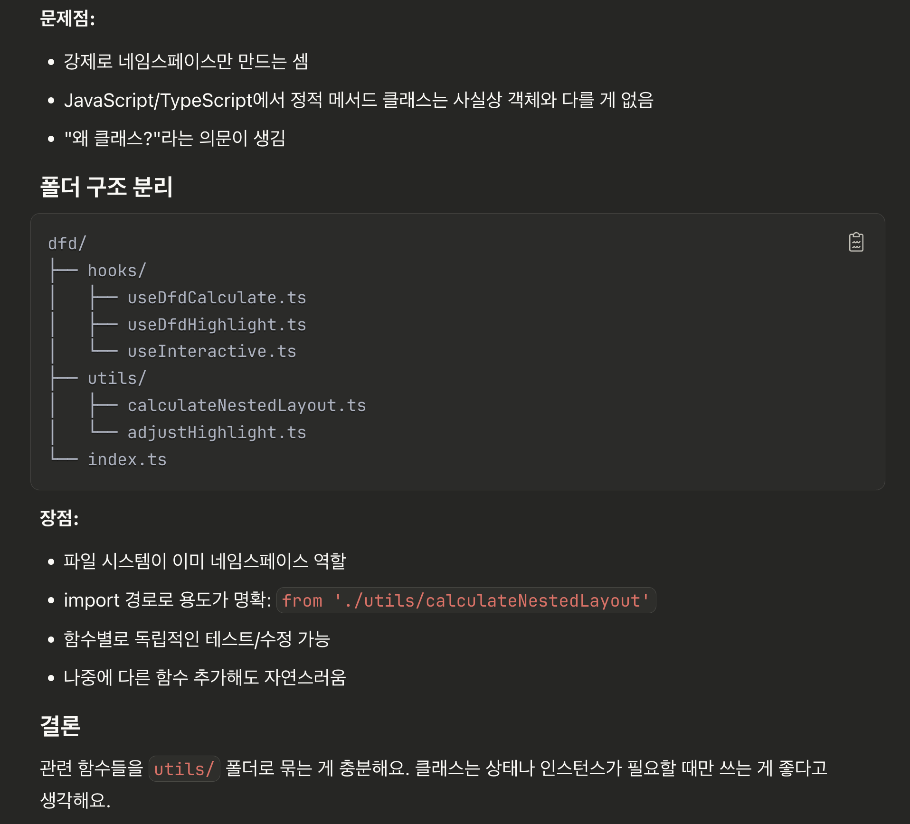

- 어쨋거나 깃도 관리하기 위해서 레포를 만듬
- 이후로 간단한 공부를 위한 메모들은 블로그가 아니라 여기를 통해 기록할것
- Obsidien의 값도 여기에 연동할 수 있으면 좋을듯

## 오늘 느낀점

- 오늘 attackPath관련해서 성능 개선에 초점 맞춰 개발을 많이함
- startTransition을 사용하는 곳이, 비동기를 호출하는 곳이 아니라, 느리게 렌더링되는 UI를 유발하는 setState함수를 감싸야 한다는점을 알게됨
- 코드를 정리할 수록 어디를 개선하면 좋을지 명확하게 나옴
- 작은 쓰레기를 주어 두어야 큰 쓰레기를 어떻게 주울지 알게 됨
- 이전에 jenkins의 빌드 속도를 개선한게 배포 테스트에 영향을 줌, 좀더 빨라서 쾌적함
- vite는 preview라는 명령어를 통해 build된 결과물을 실행할 수 있다는 사실을 알게됨

```tsx
const { data: dfdData, isSuccess } = useDfdData();
const { calculatedNodesEdges } = useDfdCalculate({ dfdData, isSuccess });
const { nodes, setNodes, onNodesChange, edges, isReady } =
  useDfdHighlight(calculatedNodesEdges);
const { isInteractive, setIsInteractive } = useDFDInteractive({
  isReady,
  showControls,
  setNodes,
});
```

- 완벽은 아니겠지만 그래도 1개의 책임에 1개의 훅을 할당하려 이렇게 수정함
- 이렇게하니, interactive에 어떤 수정을 할때 책임 소재가 명확히 나뉘어있어서 수정하기 편했음(물론 방금 수정한 코드여서 그럴 가능성이 농후할지도... 나중에 다시 수정하게 되면 어떨지 알게되겠지)
- useDfdCalculate 훅 내부에 calculateLayout 함수라던지, 즉 훅 내부에 순수함수들을 따로 모아두는 class를 만들까도 생각을 해봤지만, 당장 그러면 좋을..
- ai에게 물어보니 폴더구조로 나누는게 더 좋다고 함 다음에 그렇게 해야겠음
- 
