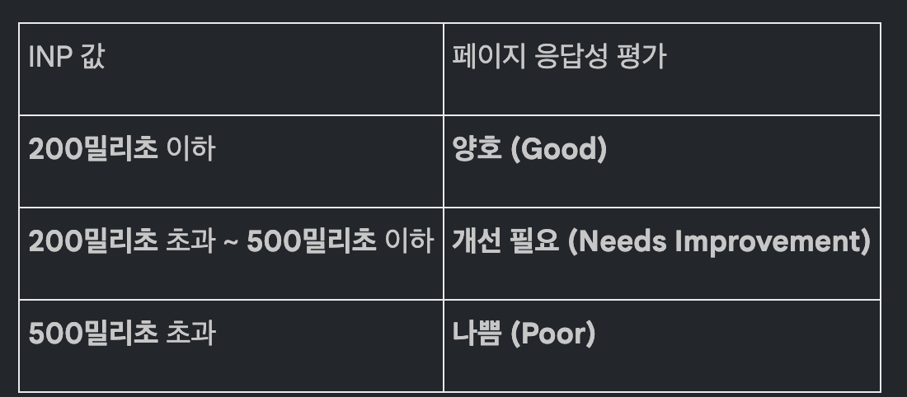
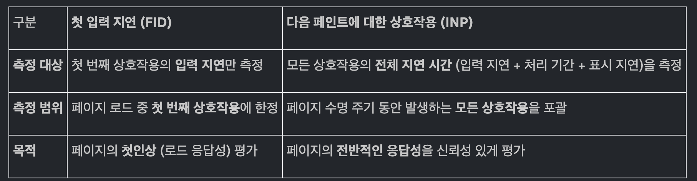

# 다음 페인트에 대한 상호작용 핵심 브리핑

- INP는 사용자가 페이지와 상호작용(클릭, 탭, 키 입력)을 시작한 시점부터 다음 프레임이 화면에 그려져 시각적 피드백이 제공될 떄까지의 지연 시간을 측정함
- 이는 페이지 로드 이후 사용자가 보내는 시간의 90% 동안 발생하는 모든 상호작용의 응답성을 포괄적으로 평사하여,
- 이전 측정항목인 첫 입력 지연(FID)을 개선한 지표

- INP 값이 200밀리초 이하일 경우 '양호'한 응답성으로 간주
- 이는 필드에 기록된 페이지 로드의 75번째 백분위수를 기준으로 함
- INP를 정확히 측정하고 최적화하기 위한 가장 효과적인 방법은
- 실제 사용자 모니터링(RUM)을 통해 필드 데이터를 수집하고, 이를 바탕으로 실험실 환경에서 문제를 재현하여 원인을 진단하는 것

---

## 1. INP의 정의 및 중요성

### 핵심 개념

- INP는 사용자의 모든 상호작용에 대하 페지의 전반적인 응답성을 평가하는 한정적인 핵심 웹 바이탈 측정항목
- 사용자가 페이지 방문 전체 생애 주기 동안 발생시킨 모든 상호작용의 지연시간을 관찰
- 최종 INP 값은 관찰된 상호작용 중 가장 기 시간을 나타냄, 이 값이 낮을수록 페이지가 대부분의 사용자 입력에 일관되게 빠르게 응답했음을 의미

### 중요성

- Chome 사용 데이터에 따르면, 사용자가 페이지에서 보내는 시간의 90%는 페이지 로드가 완료된 후 발생
- 따라서 페이지 수명 주기 전반에 걸친 응답성을 신중하게 측정하는것이 중요
- INP가 바로 이를 측정
- 사용자가 상호작용했을 때, 페이지가 빠르게 시각적 피드백을 제공해야 좋은 사용자 경험을 만들 수 있음
- INP는 이런 시각적 피드백이 지연되는 시간을 측정해 사용자 경험의 질을 정량적으로 파악할 수 있음

### 측정 목표

- INP의 목적은 상호작용으로 인해 발생하는 모든 비동기 작업의 최종 결과까지 측정하는것이 아니라,
- 다음 프레임의 페인트가 차단되는 시간을 측정하는 것.
- 즉, 사용자에게 즉각적인 시각적 피드백이 제공되기까지 걸리른 시간을 평가하는데 중점을 둠

---

## 2. INP 점수 및 평가 기준

### 점수 임계값

페이지 응답성은 다음의 기준에 따라 평가되며, 이 기준은 모바일 및 데스크톱 기기에서 수집된 필드 데이터의 75번째 백분위수를 기준으로 합니다.

### 계산 방식

페이지에서 발생한 모든 상호작용이 관찰되며, 대부분의 경우 지연 시간이 가장 긴 상호작용이 INP 값으로 보고됩니다. 하지만 상호작용 수가 매우 많은 페이지의 경우, 비정상적인 이상치를 무시하기 위해 50개의 상호작용마다 가장 긴 상호작용 하나를 제외하는 보정 작업이 이루어집니다.

---

## 3. 상호작용의 구성 요소 및 측정 대상

### 상호작용의 정의 및 수명 주기

'상호작용'이란 동일한 논리적 사용자 동작 중에 실행되는 이벤트 핸들러 그룹을 의미합니다. 예를 들어, '탭' 상호작용은 pointerdown, pointerup, click과 같은 여러 이벤트로 구성될 수 있습니다. 상호작용의 전체 지연 시간은 다음 세 부분으로 구성됩니다.

1. 입력 지연 (Input Delay): 사용자가 입력을 시작한 후 이벤트 핸들러가 실행되기 전까지의 시간. 기본 스레드에서 실행 중인 긴 작업(Long Task)에 의해 발생할 수 있습니다.
2. 처리 기간 (Processing Duration): 상호작용과 관련된 모든 이벤트 핸들러 콜백이 실행되는 데 걸리는 시간.
3. 표시 지연 (Presentation Delay): 이벤트 핸들러 실행이 완료된 후 브라우저가 다음 프레임을 화면에 표시하기까지 걸리는 시간.
   측정 대상 상호작용
   INP는 다음과 같은 유형의 상호작용만을 관찰합니다.
   • 마우스로 클릭
   • 터치스크린 기기에서 탭
   • 물리적 또는 화면 키보드의 키 누르기
   측정 제외 대상: 스크롤, 마우스 커서 올리기(hover), 페이지 확대/축소 등은 INP 측정 대상이 아닙니다.
   iframe 내 상호작용: 사용자는 페이지의 어느 부분이 iframe인지 인지하지 못하므로, 최상위 페이지의 전체 사용자 경험을 측정하기 위해 iframe 내에서 발생한 상호작용도 INP 계산에 포함됩니다.

---

## 4. INP와 첫 입력 지연(FID)의 비교

INP는 이전의 응답성 측정항목인 첫 입력 지연(First Input Delay, FID)의 후속 지표입니다. 두 지표는 다음과 같은 주요 차이점을 가집니다.

결론적으로, INP는 페이지 수명 전반에 걸친 응답성을 더 포괄적이고 신뢰성 있게 나타내는 지표입니다.

---

## 5. INP 측정 및 진단 방법

필드 데이터 (Field Data)

INP 최적화는 실제 사용자 모니터링(RUM)에서 얻은 필드 데이터로 시작하는 것이 가장 좋습니다. 필드 데이터는 실제 사용자가 경험한 INP 값뿐만 아니라, 어떤 상호작용이 느렸는지, 상호작용이 페이지 로드 중 또는 로드 후에 발생했는지 등의 맥락 정보를 제공합니다.

• Chrome 사용자 환경 보고서(CrUX): PageSpeed Insights와 같은 도구를 통해 웹사이트의 INP 필드 데이터를 확인할 수 있습니다.
• RUM 솔루션: 문제의 원인을 더 상세히 파악하고 특정 사용자 그룹이나 상호작용에 대한 깊이 있는 분석을 제공합니다.

실험실 데이터 (Lab Data)

필드에서 느린 상호작용이 확인되면, 실험실 환경에서 해당 문제를 재현하여 원인을 진단하는 것이 효과적입니다.

• 실험실 테스트 한계: 실제 사용자 행동은 예측하기 어려워 필드 데이터와 동일한 문제를 발견하기 어려울 수 있습니다. 상호작용 없이 페이지 로드만 측정하는 경우 총 차단 시간(TBT)이 INP의 프록시 역할을 할 수 있으나, INP를 완전히 대체하지는 못합니다.
• 효과적인 실험실 테스트 전략: 페이지가 로드되는 동안(기본 스레드가 가장 바쁠 때) 페이지와 상호작용하거나, 일반적인 사용자 흐름을 따라 상호작용을 테스트하여 잠재적인 병목 현상을 식별하는 것이 좋습니다.

JavaScript를 이용한 측정

web-vitals JavaScript 라이브러리를 사용하면 INP를 측정할 수 있습니다. 이 라이브러리는 뒤로/앞으로 캐시에서 페이지가 복원될 때 값을 재설정하거나, 페이지가 백그라운드로 전환될 때 값을 보고하는 등 복잡한 시나리오를 처리해줍니다. (단, 교차 출처 iframe 내 상호작용 측정에는 제한이 있습니다.)

---

## 6. INP 데이터가 보고되지 않는 경우

특정 상황에서는 페이지의 INP 값이 반환되지 않을 수 있습니다.
• 사용자가 페이지와 측정 가능한 상호작용(클릭, 탭, 키 누르기)을 하지 않은 경우.
• 사용자가 스크롤이나 마우스 오버와 같이 측정되지 않는 동작만 수행한 경우.
• 검색 크롤러나 헤드리스 브라우저와 같은 봇이 페이지에 접근한 경우.
• CrUX 데이터 세트에서 의미 있는 INP 값을 계산하기에 충분한 Chrome 사용자 데이터가 없는 경우.

---

날짜: 2025.10.10
