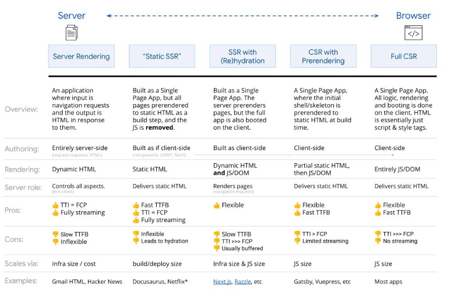

웹에 컨텐츠를 표기하는 방법은 다양하다.
어떠헥 혹은 어디서 데이터를 받아오고 컨텐츠를 렌더링하는지를 결정하는 것은 앱의 성능을 좌우하는 핵심 포인트가 되었다.
클라이언트 사이드 렌더링, 정적 렌더링, 하이드레이션, 점진적 렌더링, 서버 사이드 렌더링 등 각기 다른 바벙을 사용하기 위해 프레임웍 또는 라이브러리들이 사용된다.
이때 각 패턴의 영향과 결과를 이해하는것은 앱에 ㅅ적합한 방식을 찾기 위해 꼭 필요하다.

크롬 개발팀은 Rehydration 접근 방식보다 정적 렌더링이나 서버사이드 렌더링을 고려하도록 권장했다.
지난 시간 동안 현대 프레임웍들은 점진적로딩과 여러 렌덜이 기법들을 기본으로 구현했고, 좋은 성능과 새 기술의 적용 모두 고루고루 발전하였다.

이어지느 섹션에서는 웹 렌덜이과 관련되어 웹 렌더링의 성능 요구사항을 측정하는 가이드랑니과 각 요구사항을 만족하는 ㄹ최적의 패턴을 제안한다.
그 다음 각 패턴들을 기펙 살펴보고, 구현하느 ㄴ방버에 대해서 알아본다.
또 이런 패턴들을 구현해볼 수 이;ㅆ는 Next.js에 대해 이갸히핡섯이다.
하지만 패턴들과 Next.js에 대해 다루기전에 먼저 이런 것들을 고려하기 까지 어떻게 되어왔느닞
React프레임웍과 Next.js가 만들어진 이유가 무엇인지 알아보자.

## 짤막학 웹 렌더링 역사

웹 기술을 앱의 요구사항을 만족하기 위해 끊임없이 발전해왔음
HTML, CSS, JavaScript역시 발전함
2000년대 초 - 서버에 의해 헨덜이되는 HTML이 대부분
php, ASP같은 서버사이드 스크립팅 언어 사용

2006에 Ajax로 SPA개발하는것 알려짐
Gamil이 유명한 예시됨
Ajax는 개발자들에게 페이지를 새로 불러오지 않고도 동적으로 요청할 수 있도록 함
따라서 SPA는 데스크톱 앱과 유사하게 구현될 수 ㅣㅇㅆ엄음

곧 개발자들은 JavaScript를 사용하여 데이터르 받아오고 화면을 그림
JQueryt, Backbone.js, AngularJS가 이떄 흥함

2013에 React는 모바일 웹 기반으로 유저 인터페이스와 UI컴포넌트를 만들 수 잇느 유연한 프레임웍으로 소개됨
2015부터 2020녀까지 데이터플로우 구조 라이브러리(Redux), CSS프레임웍(REact-Bootstrap), 라우팅 라이브러리, 모바일 앱 프레임웍들을 포함해 REact생태계가 발전함
그러나 순수 클라이언트 사이드 측 ㄹ렌덜이의 단점들이 부각되며 개발자는 클라이언트나 서버 양쪽에서 최적의 성능을 내기위해 시도하게 됨

## 렌더링 - 성능의 주요 지표

위에서 이야기한 단점들에 대해 이야기하지 전에
각 렌더링 메커니즘의 선으을 어떻게 측정하는지 이해해야함
섹션에서 다룰 가 패턴들의 차이점을 비교하기 위해 용어 먼저 ㄱㄱ

- TTFB: Time to First Byte - 링크 클리과 해당 사이트의 첫 바이트를 받기까지의 시간.
- FP First Paint: 사용자가 어떤 컨테ㅐㄴ츠를 보게 되거나 화면에 약간의 픽셀이 그려지기까지의 시간
- FCP First Contentful Paint: 페이지 컨텐츠의 일부가 화면에 렌더링될때까지의 시간
- LCP Largest Contentful Paint: 메인 페이지의 컨텣ㄴ츠가 보여지기까지의 시간, 뷰포트 내에 큰 이미지나 텍스트가 보여짐을 의미
- TTI TIme to IOnteractive: 페이지에 인터렉션이 가능해지기까지의 시가니 예르들명 이벤트 핸들러 모두 바인딩
- TBT Total Blocking Time: FCP부터 TTI까지의 시간

위 성능 측정을 위한 파라미터에 대해 중요한 사항을 정리해보자.

- JavaSCript번들 사이즈가 크면 페이지를 로드할 떄 FCP와 LCP 시간이 증가하므로, 사용자는 컨텐츠가 화면에 나타나기전까지 빈 화면에 기ㅈ다리는 시간이 늘어날 것
- JavaScript번들 사이즈가 크면 TTI와 TBT에 연향을 주어, 사용자는 필수적인 JavaScript가 로드되어 바인딩이 완료되기까지 아무 인터렉션을 하지 못할것
- TTFB는 사용자의 요청을 처리하는 서버의 처리속도와 관련이 있다.
- preload, prefetch, script의 속성 처리 와 같ㅇ느 테크닉들은 브라우저가 그들을어떻게 해것하는가에 따라 위의 파라키터들을 다르게 ㅕㅂㄴ화시키니다. 이런 기능을 사용하기 전에 위의 속서들에 따라 브라우저가 로딩과 실행 우선순위를 어떻게 부여하는지에대해 알면 도움이 된다.

글에서는 아래에 나열된 패턴에 대해 알아볼것,
Next.js를 사용하면 아래 패턴들을 모두 구현가능함
패턴에 대해 이야기하지 건에 먼저 REact기반 프레임웍인Next.js에 대해 이야기해보자.

- SSR
- Static SSR(experimental flag)
- SSR with Regeneration
- CSR with Prerendering (Automatic Static Optimization 이라고 알려져있다.)
- Ful CSR

## 결론

우린 SSR의 본질적인 변형인 4가지 패턴에 대해 다루었다.
이 패턴들은 성능 파라미터를 감소시키기 위해 TTFB(Static and Incremental Static Generator), TTI(Progressive Hydration), FCP/FP(Streaming) 같은 기술들을 조합해 사용함
이 패턴들은 REact같은 크랄잉너트 사이드 프레임웍을 구현 가능하며
또한 CSR의 성능 개선을 위해 rehydration같ㅇ느것도 할수 있다.
따라서 SSR과 CSR의 장점들을 조합하여 원하는 결과를 만들어낼 수 있다.
