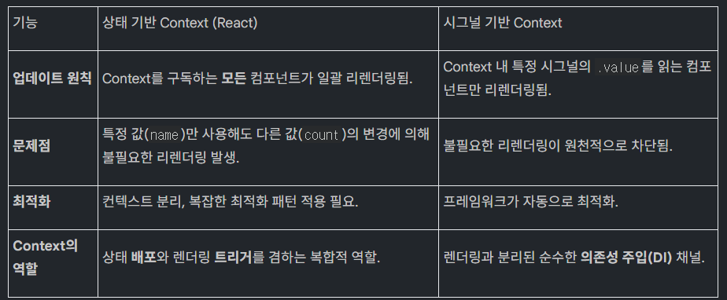

## 1. 렌더링 패러다임의 근본적이 ㄴ변화

프론트 에서 상태 관리를 논할 때 우리는 hooks, observables, signals와 같은 api형태에 집중하느 경향이 있음
그러나 최근 더 근본적인 변화가 있음
'렌더링이 어디서 일어나는가'라는 관점의 전환임

프론트엔드 아키텍처의 2가지 핵심 패러디임인
상태기반 렌더링과 시그널 기발 렌더링을 심층적으로 분석함
상태를 ㅏㄴ드는 곳에 ㅎ렌더링하느 전통적인 방식과 상태를 사용하느곳에서 렌덜이 하는 새로운 방식의 핵시 차이점 성능에 미치는 여향 그리고 각 패러다임이 적합한 사용 사례를 분ㅅ거해
기술 아키텍처 의사결정을 지원하느것을 목표로함

두 패러다임의 근볹거인 동작 원릴 비교를 시작으로, 렌더링 전파 모델, 주요 아키텍처 패턴 분석을 거쳐 성능 및 개발 경험에 미치는 영향ㅇ까지 종합적으로 다룰것
이를 통해 프로젝트에 가장 적합하 ㄴ 렌덜이 전략을 선택할 수 있는 명확한 기준을 제시하고자함

## 2. 렌더링 트리거 주체

근본적이 ㄴ차이를 이행하는것이 중요
단순히 문법적 차이르 넘어
애플리케이션의 성ㅇ능, 코드 구조, 개발자의 사고 방식 전반에 깊은 영향을 미치기 떄문ㅇ
상태를 만드는곳에서 렌더링하는 ㅈ방식과
상탤르 사요하는 곳에서 렌더링하는 방식의 차이는
렌덜이이 언제 어디서 그리고 얼마나 광범위하게 발생하는지를 결정함

### 2.1 상태 기반 렌더링

상태가 선언된 컴포넌트에서 업데이트가 발생하면, 해당 컴포넌트와 그 아래에 있는 모든 하위 컴포너트가 다시 렌더링된다는것
React의 useState가 대표적인 예
이는 상태 변경이 컴포넌트 트리 상다넹서 하위로 전파됨을 의미
이때 하위 컴포넌트가 실제로 해당 ㄱ상태값을 사용하고 있즌지 여부는 중요하지 ㅇ낳음
단지 상태를 가진 부모의 자식이라는 이유만으로 렌덜이 범위에 들어감

```jsx
const Parent = () => {
	const [count, setCount] = useState(0);

	return (
		<>
			{/* count 값을 사용하지 않더라도 리렌더가 됨 */}
			<ChildA />
			<ChildB />

			{/* 실제로 count 값을 사용하고 리렌더가 됨 */}
			<ChildC count={count} />
		</>
	);
};
```

위 예시에서 count상태가 변경되면 a, b에게 불필요할 리렌덜이이 됨

### 2.2 시그널 기발 렌더링

이 렌ㄷ더링은 이 모델을 근볹거으로 역전시킴
시그널은 스스로 의존성을 추적하느 반응형 기본 단위로 정의됨
상태를 시그널로 생성하느것마능로은 렌더링이 발생하지 않습니다.
대시 새항 시그널의 ㄱ밧에 실제 로 접근하는 커포넌트에서만 렌더링이 일어남

이런한 세밀한 반응성 덕분에 업데이트가 필요한 곳에서 만 덩화교히 리렌더링 됨

```jsx
const Parent = () => {
	const count = useSignal(0);

	return (
		<>
			{/* 리렌더가 되지 않음 */}
			<ChildA />
			<ChildB />

			{/* count 값을 읽는 경우에만 리렌더 됨 */}
			<ChildC count={count} />
		</>
	);
};
```

이런 변화는 개발자의 사고 방식또한전환 시킴
기존의 불필요하 ㄹ리렌더링을 어떻게 막을것인가 에서
필요한 곳에서만 리렌덜이이 일어난다는 확신으로 바뀌게 됨
두 패너다임의 근본적인 동작 방식의 차이는 실제 애플리케이션의 렌더링 전하 범위에 직접적인 영향을 미침

## 3. 렌더링 전파 모델 심층 분석

렌더링 전파 모델은 상태 변경이 애플리케이션의 어느 부분까지 영향을 미치는지를 결정하면
이는 성능에 직접ㅈ거인 여향을 줌
두 모델을 핵심 차이는 렌더리 ㄴ범위를 결정하느 주체가 컴포넌트 트리 구조인지
아니면 데잍 의존성에 있느닞 구분함

### 3.1 상태 기반 모델: 컴포넌트 트리 기반 전파

상태 ㄱ비잔 렌더린 모델에서는 상태가 업데이트 될 떄 그 상태가 생성되 ㄴ지점부터ㅗ 시작하여 해당 컴포너트 하위 틀리 전체가 리렌더딜ㅇ 됨
이는 직괒넞기이지만 불피료한 연상을 유ㅜ발하기 쉬움

이런 비효율을 방지핮기 위해 React.memo, useMemo, useCallback같으 ㄴ수동 최적화 기법을 직접 적용하여 렌더링 전파를 제어해야하느 ㄴ책임이 전가도미

### 3.2 시그널 기반 모델: 데이터 의존성 기반 전파

렌덜이 전파가 컴포너트 계층 구조가아닌, 에이터 의존성에 의해 ㅕㄹ정됨
핵심은 컴포너트가 어던 데이터에 의존하는ㄴ가임

상태 시그널로 고날될 떄 해당 시그널의 .value를 실제로 참조하는 컴포넌트만 업데이트 대상으로 등록됨
따라서 상태가 변경되면 프렘임워크는 컴포너늩 트리르 순회활 필요없이 해당 시그런을 구독하는 GC 2 첨포너트만 정확히 찾아리렌덜이함

이런 전파 모델의 차이는 복잡한 상태 공유 시나리오 특히 Context API사용시 그 ㅎ효과가 그대화됨

## 4. 주요 아키텍처 패턴 비교9 분석

### 4.1 Context API: 패러다임의 극명한 차이

Context API는 상태를 깊은 계층의 컴포너ㄴ틀 ㅗ전달하느 강력하 도구지만, 두 패러다임에서 동작방식을 차이를 보임


상태 기반 Context는 count 상개ㅏ 변경되명 name만 사요하는 컴포넌트까지 불피룡하게 다시 리렌더링 됨
이를 피하려면 컨텍스트를 여러개로 분리하거나 복잡한 최적화 패턴을 적용해얗마

반면 시그널 기반 Context는 컨텍스트의 역할을 순수한 읮존성 주입 도구로 변화시킴
각 컴포넌트는 컨텍스트에서 필요한 시그널만 구독하므로 다른 시그런의 변경에는 전혀 연향을 받지 않음
이는 불필요한 리렌덜이을 막기위한 복잡한 아키텍처 설꼐의 ㅍㄹ요성을 제거함

### 4.2 제어흐름을 통하 렌더링 제어

Preact와 같으 플에ㅣㄴ워크는 For, Show 같은 제엎흐름 컴포넌트를 통해 반응성의 범위를 JSX 블록 단위로 더욱 정ㅁ리하게 한정ㅁ함

```jsx
const items = signal([]);

// items 시그널이 업데이트 되었을 때, 오직 영향을 끼치는 items만 리렌더됩니다.
<For each={items}>
	{(item) => (
		<div>
			{/* item.name.value가 변경되었을 때 오직 이 <span>만 리렌더됩니다. */}
			<span>{item.name.value}</span>
			<button onClick={() => item.count.value++}>{item.count.value}</button>
		</div>
	)}
</For>;
```

훅 기반 방식에서는 리스트의 한 항목이 변경될 떄 다른 형제 항목이나 부모 ㄹ컴포너트까지 리렌더링 이 전파될 ㅅ ㅜ있으며 ㅇ막기 위해 각 항목에 꼼꼼히 메모이제이션을 해야함

하지만 위 예시처럼 제어 흐름 컴포넌트트 사용하며 item.name 시그널이 변경되엉ㅆ을 떄 오직 해당 아이템의 span 태그만 리렌더링되는 정교한 제어 가능
이는 2.2.절에 언급한 세밀한 반응성이 컴포넌트 단위를 넘어 DOM엘ㅇ리먼트 수준까지 적요됨을 의미함

## 5. 성능 및 개발 경험에 미치는 영향

두 패러다임 차이는 이론을 넘어 실재 성능과 생산성에ㅐ 실질적인 영향을 미침
시그널 기반 렌더리응ㅁ 다음과 같음 여확한 이점을 제공함

- 연산량 감소
  - 상태 변경과 무관한 컴포넌트에서는 render 함수 호출, 가상 DOM비교, useEffect재실행등이 전혀 이러아지 않음
  - 이는 실행되는 js양을 절대ㅐ적으로 감소시켜 정능 향앗으로 이어짐
- 번들 크기 감속
  - React.memo, useCallback같은 수동 최적화 르 ㄹㄹ위한 헬퍼 함수기 ㅍ리요없어짐
  - 프레이무어크의 반응형 시스템이 자돋으로 최적화를 처리하므로 코드가 간결해지고 번들 크기도 작아짐
- 예측 가능한 성능
  - 성능 변동성이 둘어들고 디벋깅이 용이해짐
- Prop Dilling 문제 해소
  - 시그널은 Context난 직접 import를 ㅌ오해 여러 계층 아래로 전달되어도 중가 컴포너트가 불피룡한 리렌덜이을 유ㅜ발하지 않음
  - 이로인해 상태 전달을 위해 흔히 사요하던 복잡하 ㄴProvider피라미드 구조도 만들 필요없어짐

## 6. 의사 결정 프레임워킈 어떤 패러다임을 선택할 것인가?

### 6.1 상태 기반 렌더링이 적합한 경우

상태 기반 모델은 단순성과 광범위하 ㄴ생태계 ㅈ덕분에 많은 시나리오에서 유용하고 실용적인 선택임

- 규모가 작고, 중첩이 깊지 ㅇ아ㅏㄶ은 컴포넌트 트리
  - 불필요한 리렌더링으로 성능 저하가 크지 않은 경우

### 6.2 시그널 기반 렌더링이 강력한 우위를 보이는 경우

애플리케이션ㄴ의 복잡할 수록 극대화됨

- 규모가 크며 복잡한 커뫂넌트 트리:
  - 불필요한 리렌덜이을 원척적으로 차단, 일관된 성능 유지
- 업데이트 빈도가 매우 ㅇ높은 애플리케이션
  - 실시간 데이터 시각화, 복잡하 애니메이션 등 잦은 상태 변경이 발생하는 경우
  - 최소한의 연산만으로 UI를 어베이트흐여 부드로어누 사용자 경험 제공
- 사앹 여러 컨텍스트난 전역 저장소에 복잡하게 분산되 대규모 애프링ㅇ케이션

## 7.0 결론: 반응성 패러다임의 미래

본 백서에서 살펴본 바와 같이, 상태 기반 렌더링에서 시그널 기반 렌더링으로의 전환은 단순한 성능 최적화를 넘어, 반응성을 바라보는 개발자의 사고방식 자체를 바꾸는 중요한 변화입니다. 핵심은 "리렌더링을 메모이제이션으로 '막는' 것"에서 "필요한 곳에서만 '발생시키는' 것"으로의 관점 전환입니다.
"상태를 생성하는 곳에서 렌더링"하던 방식에서 "상태를 사용하는 곳에서 렌더링"하는 방식으로의 전환은 코드를 실제 데이터 흐름에 더 가깝게 만듭니다. 시그널을 읽는 컴포넌트는 그 값이 바뀔 때 리렌더링되고, 읽지 않는다면 아무 일도 일어나지 않는다는 단순하고 명확한 규칙은 개발자의 정신적 모델을 크게 단순화시킵니다.
